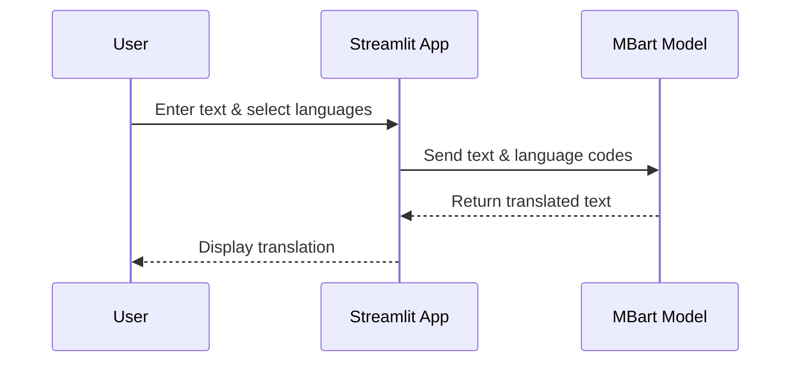

## Slide 1: Title
**Multilingual Translator Web App**  
Made with ❤️ by B Sai Teja Goud

---

## Slide 2: Introduction
- A web application for translating text between multiple languages.
- Uses state-of-the-art NLP models (MBart) for accurate translation.
- Built with Python, Streamlit, and HuggingFace Transformers.

---

## Slide 3: Motivation
- Language barriers hinder communication and access to information.
- Need for easy, fast, and reliable translation tools.
- Support for many languages in a single interface.

---

## Slide 4: Technology Stack

```mermaid
graph TD
    A[User] -->|Input Text| B[Streamlit Web App]
    B --> C[MBart Model (HuggingFace)]
    C --> D[Translated Output]
    B --> E[PIL for Images]
```

- **Streamlit**: UI and interaction
- **Transformers (MBart)**: Translation engine
- **PIL**: Image handling

---

## Slide 5: Features

- Translate text between 50+ languages.
- Simple, intuitive UI.
- Fast and accurate translations.
- Banner image for branding.
- Language selection via sidebar.

---

## Slide 6: Workflow



---

## Slide 7: Code Overview

- Imports: `transformers`, `streamlit`, `PIL`
- Loads MBart model and tokenizer
- Caches model for performance
- UI: Banner, sidebar, text area, button
- Translation logic on button click

---

## Slide 8: UI Screenshot

*(Insert screenshot of your app here, showing the banner, sidebar, and translation area)*

---

## Slide 9: Example Usage

- Input: "Hello, how are you?" (English)
- Output: "नमस्ते, आप कैसे हैं?" (Hindi)

---

## Slide 10: Future Improvements

- Add transliteration support.
- Support for speech input/output.
- Mobile-friendly UI.
- Save translation history.

---

## Slide 11: References

- [HuggingFace MBart Documentation](https://huggingface.co/docs/transformers/model_doc/mbart)
- [Streamlit Documentation](https://docs.streamlit.io/)
- [PyTorch Installation](https://pytorch.org/get-started/locally/)

---

## Slide 12: Contact

- Name: B Sai Teja Goud
- Email: saitej0045@gmail.com

